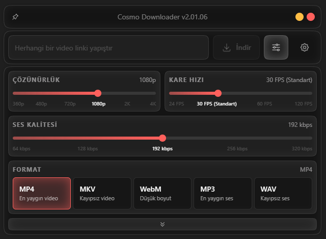

# Cosmo Downloader
> **This project is currently under-development, it WILL NOT WORK if you try to use it.**<br>
> **Currently only available for Windows**



**Cosmo Downloader** is a high-performance video downloader designed for power users who value speed and aesthetics.
It combines the raw power of **yt-dlp** and **FFmpeg** with a native **C++** backend and a sleek **WebView + React** user interface.

Designed to stay fast, minimal, and lightweight. No more bloated Electron-based apps that eat up your RAM; Cosmo Downloader leverages a native C++ core for logic and the system's lightweight WebView for rendering. I've started to build this out of necessity and kept developing out of passion for creating something useful.

Also, **this is my first open-source project!** Please feel free to suggest anything or contribute!
<br>
<br>

## Features
- **Hybrid Architecture:** Native C++ performance meets modern Web UI design.
- **Lightweight:** Uses system's WebView2 (Edge) instead of bundling a full browser engine like Electron.
- **Advanced Control:** Full control over codecs, bitrate, framerate, and resolutions via FFmpeg.
- **Smart Parsing:** Paste a link and let the internal engine handle the rest.
<br>

## Architecture & Dependencies
Cosmo Downloader is built using **C++** for the heavy lifting and **React (TypeScript)** for the user interface.
The application handles the orchestration of external tools automatically.

- **C++ Core** — Application logic, process management, and native system integration.
- **WebView + React** — A modern, reactive user interface.
- **yt-dlp** — Platform extraction & media handling (managed internally).
- **FFmpeg** — Encoding, remuxing, and processing (managed internally).

*Note: The application requires the Microsoft Edge WebView2 Runtime (pre-installed on most modern Windows versions).*
<br>

## To-Do
- [x] C++ & WebView + React architecture
- [x] Basic IPC (Inter-Process Communication)
- [x] Preferences UI & implementation
- [x] Settings UI & implementation
- [x] Browser selection for cookies
- [x] YouTube downloader
- [x] Instagram downloader *(WIP)*
- [x] TikTok downloader *(WIP)*
- [x] Batch downloading
- [x] Audio extraction
- [x] Thumbnail downloader
- [ ] Subtitle support
- [ ] FFmpeg integration
- [ ] Download history
- [x] Clipboard detection
- [x] Multi-language support *(currently 3)*
- [ ] MacOS support (via WebKit)
- [ ] Linux support (via WebKitGTK)
<br>

## Build Instructions

### Prerequisites
- **C++ Compiler** (MSVC recommended)
- **CMake** (v3.20+)
- **vcpkg** (Package Manager)
- **Node.js & npm** (For building the UI)
- **Git**

### Building

1. **Clone the repository:**
```bash
git clone https://github.com/seckinaktunc/cosmo-downloader.git
cd cosmo-downloader
```

2. **Build the Frontend (React):**
```bash
cd ui
npm install
npm run build
cd ..
```

3. **Configure and Build (C++):**
```bash
cmake -B build -S . -DCMAKE_TOOLCHAIN_FILE=<path-to-vcpkg>/scripts/buildsystems/vcpkg.cmake
cmake --build build --config Release
```