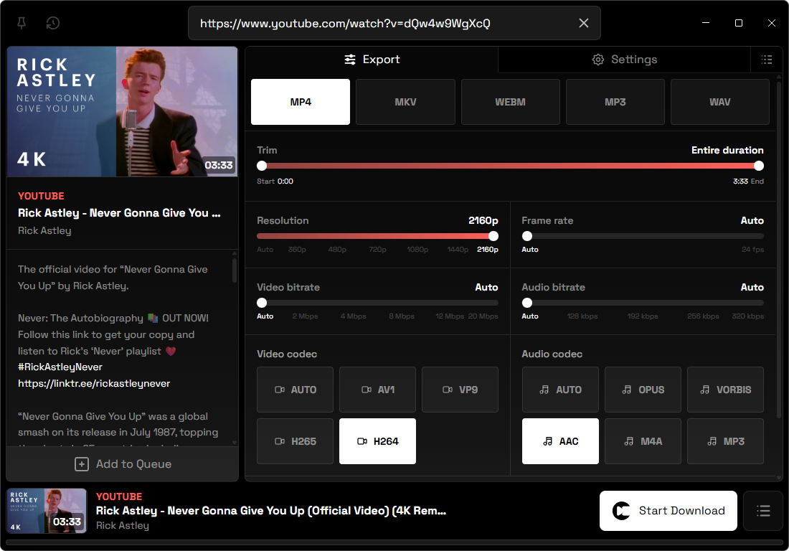
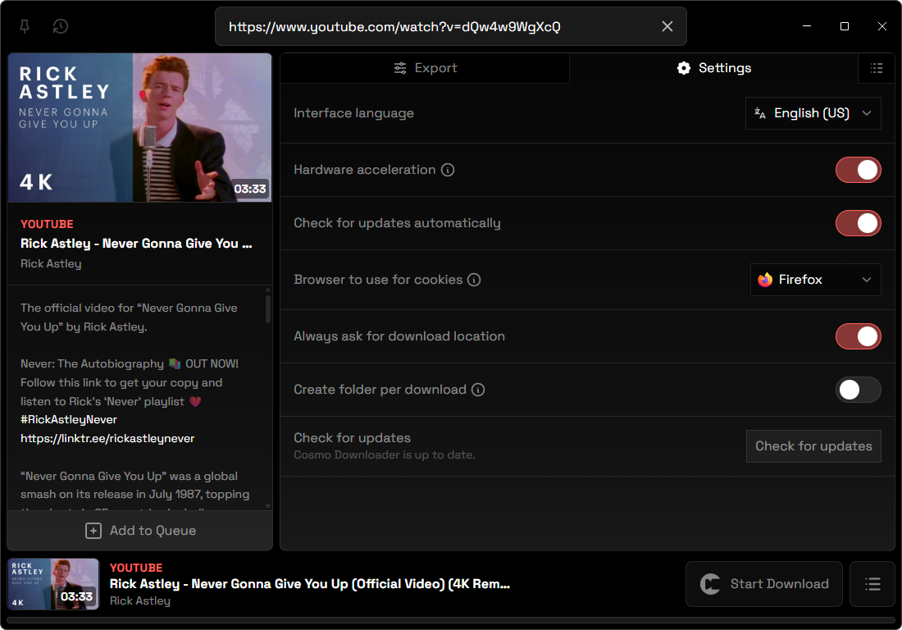
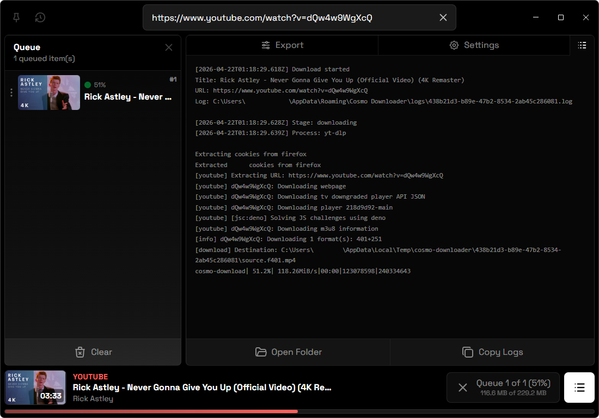

# Cosmo Downloader

A high-performance video downloader for power users who value speed and aesthetics.

  
  
  

> **Now available on all operating systems!**

Cosmo Downloader wraps the raw power of **yt-dlp** and **FFmpeg** in a modern UI, giving you fine-grained control over codecs, bitrate, resolution, and more. Behind the scenes it also bundles **Deno** as yt-dlp's local JavaScript runtime and **ffprobe** for media inspection. No pay-walls, no ads; just a powerful, user-friendly and sexy downloader.

**Download the latest release:** https://github.com/seckinaktunc/cosmo-downloader/releases

## About

I started building this out of necessity and kept working on it out of passion. Every other video downloader I tried was either pay-walled, ad-filled, or barely worked. Now that I can reliably use it myself, I'm genuinely excited to finally share it with people.

If it helps you, that's enough for me. If you have ideas, issues, or want to contribute; please do.

- **Zero external installs:** `yt-dlp`, `Deno`, `ffmpeg`, and `ffprobe` ship bundled
- **Local-only:** No telemetry, no analytics, no account required

## Features

### Downloading

- Paste any URL [supported by yt-dlp](https://github.com/yt-dlp/yt-dlp/blob/master/supportedsites.md)
- Video + audio or audio-only extraction
- Thumbnail download / copy
- Trim / clip with in and out timecodes

### Format & control

- **Currently supported formats:** `mp4`, `mkv`, `mov`, `webm`, `mp3`, `wav`
- **Video codecs:** `av1`, `vp9`, `prores`, `h265`, `h264`, or `auto`
- **Audio codecs:** `opus`, `vorbis`, `aac`, `mp3`, `wav`, or `auto`
- Resolution and bitrate selection (up to 4K/20mbps/320kbps)
- Hardware acceleration (if your system supports it)

### UX

- Sequential and fully editable download queue
- Persistent download history with re-queue option
- Live per-download log viewer
- Clipboard-aware URL intake
- Browser cookie import for age-restricted content (check [Supported Browsers](https://github.com/yt-dlp/yt-dlp/issues/11352#issuecomment-2438518560))
- Auto-update checks via GitHub Releases
- Editable per-video download location and filename rules

## Installation

### Windows

1. Grab the latest `cosmo-downloader-<version>-setup.exe` from the [Releases](https://github.com/seckinaktunc/cosmo-downloader/releases) page.
2. Run the installer.
3. Launch **Cosmo Downloader** from the Start Menu or your desktop.

### macOS

1. Grab `cosmo-downloader-<version>-mac-arm64.dmg` for Apple Silicon or `cosmo-downloader-<version>-mac-x64.dmg` for Intel from the [Releases](https://github.com/seckinaktunc/cosmo-downloader/releases) page.
2. Open the DMG and drag **Cosmo Downloader** into `Applications`.
3. Launch **Cosmo Downloader** from `Applications`.
4. If macOS blocks the first launch, right-click the app and choose **Open** once, or allow it in **System Settings > Privacy & Security**.

### Linux (x64)

1. Grab the latest `cosmo-downloader-<version>.AppImage` from the [Releases](https://github.com/seckinaktunc/cosmo-downloader/releases) page.
2. Mark it executable if needed: `chmod +x cosmo-downloader-<version>.AppImage`
3. Run the AppImage.

Packaged Windows, Linux, and macOS releases can check for updates on launch when a new release is available (can be disabled in Preferences).

## Usage

1. Copy a video URL to your clipboard and let Cosmo pick it up automatically.
2. Pick your format, codec, resolution, and bitrate (or you can leave everything on auto).
3. Trim with in/out timecodes if you don't want to download the entire thing.
4. Hit **Start Download**. That's it.

See the [FAQ](docs/FAQ.md) for more.

## Architecture

Cosmo Downloader is a standard Electron app:

- **Electron main process:** Download orchestration, queue, history, preferences, updates
- **React + TypeScript + TailwindCSS** combination for UI
- **yt-dlp:** Platform extraction and media retrieval (bundled)
- **Deno:** Local JavaScript runtime passed to yt-dlp when required (bundled)
- **FFmpeg + ffprobe:** Encoding, remuxing, trimming, and media inspection (bundled)

State is managed with Zustand. IPC between main and renderer is fully typed. Tests are written in Vitest.

## Roadmap

- [x] Electron + React architecture
- [x] FFmpeg integration
- [x] Export Settings UI & implementation
- [x] Preferences UI & implementation
- [x] Browser selection for cookies
- [x] Multi-platform downloader
- [x] Audio extraction
- [x] Thumbnail downloader
- [x] Trimming with scrub previews
- [x] Queueing
- [x] Download history
- [x] Clipboard detection
- [x] Metadata prefetch
- [x] Multi-language support
- [x] Logs viewer
- [x] Caching
- [x] Windows build
- [x] Linux build
- [x] macOS build
- [ ] Parallel downloading
- [ ] Playlist support
- [ ] Subtitle support
- [ ] Automated tasks

## Contributing

Issues and PRs welcome. For non-trivial changes, please open an issue first to discuss the approach before submitting a PR. Contributions are accepted under the same [license](LICENSE) as the project.

## License

Released under a **[Custom Non-Commercial License](LICENSE)**. Personal use and modification are permitted; commercial use requires prior written permission.

## More

- [Changelog](docs/CHANGELOG.md)
- [Build from Source](docs/BUILD_FROM_SOURCE.md)
- [FAQ](docs/FAQ.md)
- [Troubleshooting](docs/TROUBLESHOOTING.md)
- [Disclaimer](docs/DISCLAIMER.md)
- [Privacy Policy](docs/PRIVACY.md)
- [Terms of Service](docs/TERMS.md)
- [Contact](https://www.seckinaktunc.com)
